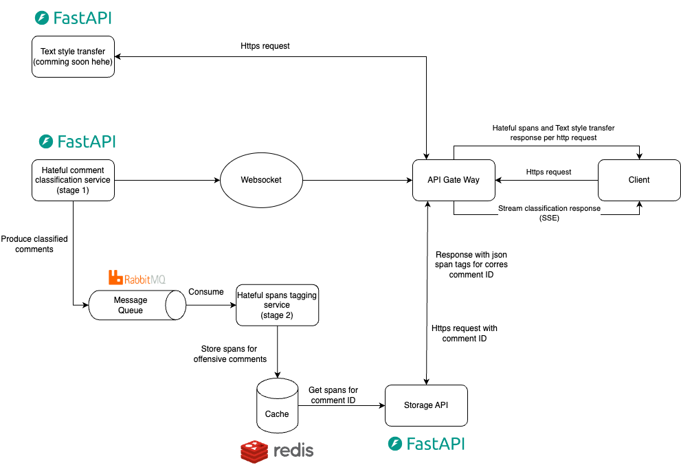

# Real-time hate comment monitor system
This repository contains a two-stage system designed to detect hate comments in real-time on YouTube live chats. The overall structure and features of the system are as followed:

- **Classification system service** (Stage 1): The first stage is a classification system that continuously processes incoming live chat comments for a specific video. It categorizes each comment as either "non-offensive" or "offensive". All processed comments, along with their respective classification labels, are returned to the client. Comments flagged as "offensive" are forwarded to the second stage for further analysis.

- **Hate-speech span tagging** (Stage 2): The second stage focuses on refining the hate speech detection by performing span tagging on the offensive comments received from Stage 1. This process involves identifying specific words or phrases within a comment that constitute hate speech. This provides a more detailed classification and assists moderators in evaluating the hate level of offensive comments based on the hate-span coverage within the comment sentence.

- **Text-Style transfer**: This service transforms offensive comments into non-offensive ones while preserving the original meaning. It utilizes a generative model (GPT2) guided by a prompt construction framework and a reranking model to achieve this transformation.
## Workflow
This section describes the system's workflow.

Each component is organized as a separate service and inter-service communication is facilitated with the RabbitMQ message queue. The workflow is designed with a focus on minimizing latency.

#### API Gateway
An API gateway acts as a central intermediary between clients and a system's microservices. All interactions with the system's components occur through HTTP requests directed to the API gateway.

#### Hate-comment classification service
The classification service is connected to the API Gateway through a unidirectional WebSocket endpoint. A YouTube video ID is provided through endpoint parameters. As requested, the service streams chat from live chat video to the service using Pytchat, each comment is then processed through a machine learning model and returns a classification probability of being offensive. the classification then returns the comment, video ID, and classification probability as a JSON message through websocket connection, while sending this same JSON message to a queue for stage 2 analysis. The client when requesting this service via the API gateway will receive server-sent events with the JSON message during the live chat.

#### Hate-span tagging service
Hate-span tagging service consumes messages sent from the first stage through a message queue. If the classification probability is larger than a certain threshold (Default at 0.3), then the comment is processed by a machine-learning model for the task of hate-spans tagging. The comment, video ID, and span tags are encapsulated within a HashModel and stored in a Redis database. These objects can be retrieved through a storage API. 

#### Text-Style transfer
Can be accessed with HTTP Request. The original comment is received and processed by the models. The style-adjusted comment along with the original comment is returned via a JSON message to the client. **The service is not yet available**

## Component
This section provides insights into each component of the system.
### Hate-Comment classification
The primary function of this classification system is to process incoming live chat comments for a specific video and categorize them as either "non-offensive" or "offensive." The system comprises two main components. The first component involves fetching live chat comments from YouTube using the Pytchat Python package, which simplifies the process of interacting with the YouTube API. The second component is the classification model, which employs n-grams, Bag-of-Words, and logistic regression. Details of the model are provided below.

This classification task is based on [VISHD](https://arxiv.org/abs/2103.11528) dataset, which contains more than 33,000 Vietnamese comments retrieved from Vietnam social media platforms. 

Given the real-time constraints of the task, minimizing latency was paramount. To this end, I experimented with a variety of models, including traditional machine learning techniques (Bag-of-words, TF-IDF, and text embeddings with logistic regression) and deep learning approaches (pre-trained text embeddings with Bi-LSTM and BERT).

Based on F1-score, precision, and inference time, I ultimately selected two models: a Bag-of-words model incorporating n-grams and logistic regression, and a fine-tuned FastText embedding model coupled with logistic regression. Despite their relative simplicity compared to deep learning counterparts, these models exhibited comparable performance while offering significantly faster inference times. Detailed experimental results and training procedures are documented in the accompanying Jupyter Notebook.

I believe that the effectiveness of these simpler models can be attributed to the relatively straightforward nature of Vietnamese offensive comments, which often rely on specific phrases and word patterns readily captured by Bag-of-words and n-gram features.

### Hate-speech span tagging
The second stage focused on detecting hateful or offensive spans within sentences identified as potentially problematic in the first stage. This granular approach offers several advantages. Moderators can directly address specific offensive content, and we can quantify the level of offensiveness based on the identified spans. 

The hate-speech span tagging task is conducted using the [VIHOS](https://arxiv.org/abs/2301.10186) dataset, which includes 26,476 human-annotated spans across 11,056 comments.

To tackle this task, I explored two primary deep learning structure: Bi-LSTM with Conditional Random Fields (CRF) and BERT-like models (Pho-bert, Distil-Bert and XML-R). In experiments, While the Bi-LSTM + CRF model effectively handled sequential tagging, the BERT models, with their self-attention mechanism, demonstrated superior performance by capturing contextual nuances. Although latency was less critical in this stage compared to the first stage, the BERT model's inference time of up to 3 seconds for longer comments was notable. To compress the model size, a quantized version of the model is being worked on

To optimize performance, The stage 2 service constantly consumes the classified comments from stage 1 via message queue, pre-process, and stores those in a Redis database, anticipating customer requests to ensure timely data transfer. These processed comment spans can then be efficiently retrieved via a dedicated storage API.

### Text-style transfer
This module aims to transform offensive comments into non-offensive ones while preserving the original meaning, essentially censoring hate speech. It leverages techniques from the state-of-the-art paper [Promt & Rerank](https://arxiv.org/abs/2205.11503) by Mirac et al. This approach relies on two key sub-modules: prompt engineering and a reranking model.

The paper mathematically defines the text-style transfer problem and identifies three crucial components for the reranking model: 
- **Text similarity:**  How well does the style-transfered sentence retain the original meaning?
- **Transfer strength:** How likely is the sentence to be written in the offensive style? (Stage 1 Model)
- **Fluency:** Does the rephrased sentence read naturally?

To implement these components of the reranking model, I  plan to follow this approach: 

- Text similarity is evaluated using [BertScore](https://arxiv.org/abs/1904.09675) model.

- To evaluate transfer strength, I will use the logistic model or a BERT model in stage 1 models, to estimate the probability of a sentence is of the style of offensive, although this is a simplified version comparing to the model in the paper.
- Lastly, to evaluate the fluency,  I would used finetuned GPT-2 on Vietnamese dataset. 

**This module is being implemented and trained, not yet used**